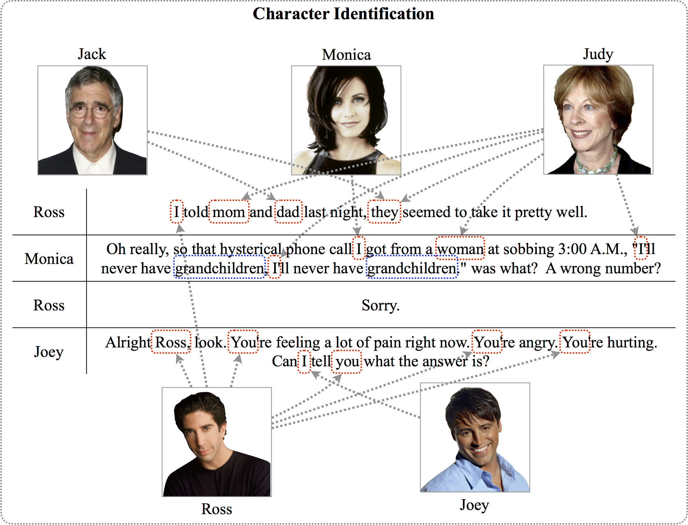

## Speaker Identification Corpus
#### Currrent Version: *v1.0*

We introduce a new multiparty conversation transcript corpus wiht annotations of mention referent information with BILOU tags. The corpus is avaliabe in `JSON`, `TSV`, and `CoNLL'12` formats. The followings are examples of annotaions, statistics, and structures of our corpus.

#### Task Illustration and Example

Example annotations for the above dialogue (Only for the mentions):
	
	I		U-Ross
	mom		U-Judy
	dad		U-Jack
	they	U-Judy,Jack
	...		...
	
### Corpus Statistics

|    TV Shows     | Season | Episode | Scene | Speaker | Utterance | Statement | Word   | Annotation |
|:---------------|:------:|--------:|------:|--------:|----------:|----------:|-------:|-----------:|
| Friends         |    1   |      24 |   229 |     116 |     5,344 |     9,168 | 76,038 |     10,245 |
|                 |    2   |      22 |   219 |     113 |     9,626 |    12,368 | 82,737 |     10,543 |
| Big Bang Theory |    1   |      17 |    95 |      31 |     2,425 |     3,302 | 37,154 |      5,019 |

### Corpus Structures
The following figure illustrates the structure of our corpus ([Source code](../src/main/java/edu/emory/mathcs/nlp/mining/character/structure)):

Each season is divided into episodes, and each episode is divided into scenes based on the boundary information provided by the transcripts. Each scene is divided into utterances where each utterance belongs to a speaker (e.g., *the scene in Figure 1 includes four utterances*). Each utterance consists of one or more sentences that may or may not contain action notes enclosed by parentheses (e.g., *Ross stares at her in surprise*). A sentence with its action note(s) removed is defined as a statement.

### Corpus Formats
##### JavaScript Object Notation (JSON)
The corpus is available in JSON format including utterances and statementsk though the data are **in raw text form with no parsing information or annotation**. The structure of the JSON format are the same with as described in the figure above. For example:

	{
  		"season_id": 1,
		  "episodes": {
		    "1": {
		      "episode_id": 1,
		      "scenes": {
		        "1": {
		          "scene_id": 1,
		          "utterances": [
		            {
		              "utterance_id": 0,
		              "speaker": "Monica",
		              "utterance_raw": "There's nothing to tell! He's just some guy I work with!",
		              "statment_raw": "There's nothing to tell! He's just some guy I work with!"
		            },
		            ...
	}

##### Tab-Separated Values Format (TSV)
The corpus is available in TSV format. **Only statements are included** for this format. Use with JSON format if action notes are needed. The data is pre-parsed with the [NLP4J](https://github.com/emorynlp/nlp4j) Parser to provide part-of-speech tag, dependency tree structure, and named entity tag information. Each file contains a single scene within an episode of a certain show. Files are named with six digits in the format of `######.tsv` where the first two digits indicates the season number, the middle two digits indicates the episode number, and the last two digits indicates the scene number. Files can be read with provided reader [`SceneTSVReader:DEFAULT`](../src/main/java/edu/emory/mathcs/nlp/mining/character/reader/SceneTSVReader.java) in this project Date are formatted as shown in the sample below.

	0	0	1	There	there	EX	speaker=Monica	2	expl	_	O	O
	0	0	2	's	's	VBZ	_	0	root	_	O	O
	0	0	3	nothing	nothing	NN	_	2	attr	_	O	O
	0	0	4	to	to	TO	_	5	aux	_	O	O
	0	0	5	tell	tell	VB	_	3	relcl	_	O	O
	0	0	6	!	!	.	_	2	punct	_	O	O

	0	1	1	He	he	PRP	speaker=Monica	2	nsubj	_	O	U-Paul
	0	1	2	's	's	VBZ	_	0	root	_	O	O
	0	1	3	just	just	RB	_	5	advmod	_	O	O
	0	1	4	some	some	DT	_	5	det	_	O	O
	0	1	5	guy	guy	NN	_	2	attr	_	O	U-Paul
	0	1	6	I	I	PRP	_	7	nsubj	_	O	U-Monica
	0	1	7	work	work	VBP	_	5	relcl	_	O	O
	0	1	8	with	with	IN	_	7	prep	_	O	O
	0	1	9	!	!	.	_	2	punct	_	O	O

Information of each column are the following.

1. `u_id`: utterence id.
2. `s_id`: statement id.
3. `n_id`: node id (`0` is resversed for root node).
4. `form`: word form.
5. `lemma`: lemma.
6. `pos`: part-of-speech tag.
7. `feats`: extra features; features are delimited by `|`, and keys and values are delimited by `=` (e.g., `k1=v1|k2=v2`).
8. `dhead`: dependency head token ID.
9. `deprel`: dependency label.
10. `sheads`: semantic heads; head IDs and labels are delimited by `:`.
11. `nament`: named entity tags in the BILOU notaiton.
12. `menref`: mention referent information in the BILOU notaiton.

##### CoNLL'12 Coreference Resolution Shared Task Format
The corpus is available in the formt for CoNLL'12 Coreference Resolution shared task (See [CoNLL-2012 Shared Task: Data](http://conll.cemantix.org/2012/data.html)). **Only statements are included** for this format. Use with JSON format if action notes are needed. The data is pre-parsed constituency tree structure with the [Berkeley Parser 1.7](https://github.com/slavpetrov/berkeleyparser). All speaker information of a utternece is provided in the speaker information column. The CoNLL'12 data of our data comes in two document organiations. (1) Episode-delimited: Each document contains an episode (including all scenes within the episode) of a certain TV show. (2) Scene-delimited: Each document contains only one scene within an episode of a certain show. Each scene(document) has no correlation with one another.

### Corpus Downloads

| TV Shows        | Season | Format        | Note                       |
|-----------------|--------|---------------|----------------------------|
| Friends         | 1      | [JSON](https://drive.google.com/open?id=0B6PZ5jrmL43iM0lpR3RaLUw0SWc)          |                            |
|                 |        | [TSV](https://drive.google.com/open?id=0B6PZ5jrmL43idUxSY01vbVh1V2s)           |                            |
|                 |        | [CoNLL-Episode](https://drive.google.com/open?id=0B6PZ5jrmL43iX3M0UG9uUC1LZlk) | Each episode as a document |
|                 |        | [CoNLL-Scene](https://drive.google.com/open?id=0B6PZ5jrmL43iakFER1ktNHBlV28)   | Each scene as a document   |
|                 | 2      | [JSON](https://drive.google.com/open?id=0B6PZ5jrmL43iQkR3ak0xdFU0bnM)          |                            |
|                 |        | [TSV](https://drive.google.com/open?id=0B6PZ5jrmL43iWUp2VUV6X29FRE0)           |                            |
|                 |        | [CoNLL-Episode](https://drive.google.com/open?id=0B6PZ5jrmL43iOG5XQnJwMWZRZE0) | Each episode as a document |
|                 |        | [CoNLL-Scene](https://drive.google.com/open?id=0B6PZ5jrmL43iWmpSMElBd1ZzNFU)   | Each scene as a document   |
| Big Bang Theory | 1      | [JSON](https://drive.google.com/open?id=0B6PZ5jrmL43iZUNUZjhlR25JazA)          |                            |
|                 |        | [TSV](https://drive.google.com/open?id=0B6PZ5jrmL43iYURoT1dUNE9aUHc)           |                            |
|                 |        | [CoNLL-Episode](https://drive.google.com/open?id=0B6PZ5jrmL43icmI1TkxnS2RkQ0U) | Each episode as a document |
|                 |        | [CoNLL-Scene](https://drive.google.com/open?id=0B6PZ5jrmL43iWXVUVEFqeTNKSTQ)   | Each scene as a document   |
